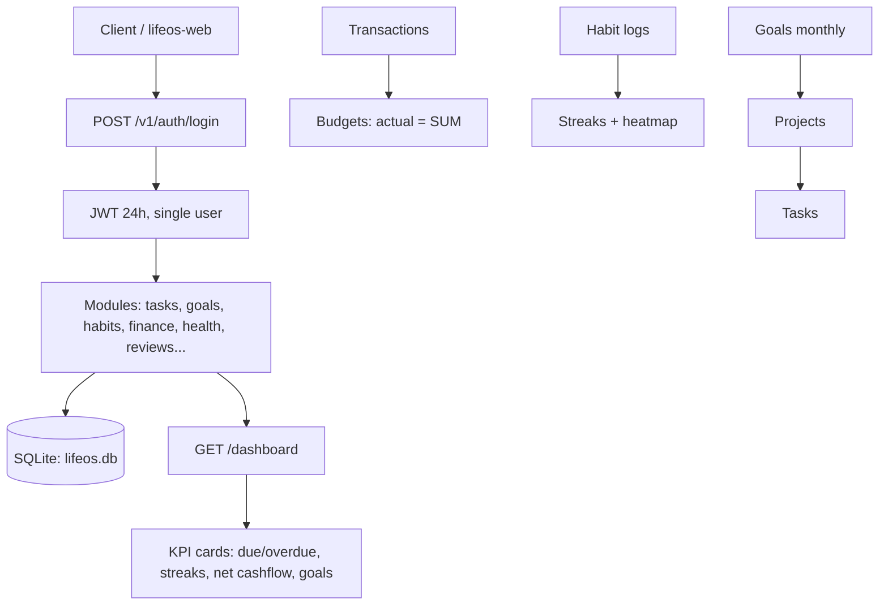

# lifeos

Personal Life OS — **Go/Gin + SQLite + JWT, single-user lokal**.
`database/sql` tanpa ORM, migrasi goose. Reuse pola shiftbase, tanpa Docker/MySQL.
Dashboard web: [`lifeos-web`](https://github.com/RakhaYandra/lifeos-web) (Vite+React+TS, identitas Nexus).

## Purpose, Output & Expectations

**Purpose.** Personal productivity is scattered across notes apps,
spreadsheets, and memory: tasks, habits, money, health, and goals never meet.
LifeOS unifies them in one local-first system with a single SQLite file —
no cloud, no subscription, full ownership of personal data.

**Output.** A single-user REST API (`:8080`) covering the full MVP loop
(tasks → habits → goals → finance → reviews) plus Fase 2 depth (quarterly
goals, milestones, period reviews, travel, decisions, savings, assets,
contacts), with a one-call `/dashboard` aggregate, Swagger + Postman/Newman
contracts (75 checks), and Indonesian fictional seed across every table.

**Expectations.** After running + seeding: the dashboard is alive on first
login (due/overdue tasks, streaks, monthly cashflow, active goals); every KPI
traces back to seed rows; the web app is usable daily without touching Excel.

## Features

| Feature | Description |
|---|---|
| Auth + Settings | - Single-user register (first account only), JWT login, per-user settings. - Purpose: private local app with one owner. Output: token + active-year/currency/thresholds. |
| Tasks + Projects | - Inbox capture, statuses, priorities, due dates; overdue/days-remaining computed; project progress from tasks; today/week views. - Purpose: capture → do → done loop. Output: what is due, overdue, and done. |
| Goals + Milestones | - Annual → quarterly → monthly cascade with parent validation; progress capped 0–100; milestones with overdue flags. - Purpose: break yearly ambitions into monthly execution. Output: progress % per level. |
| Habits | - Daily/weekly check-ins, streaks, 30-day heatmap via log history. - Purpose: consistency made visible. Output: streaks and heatmaps. |
| Finance | - Transactions, budgets with auto-computed actuals (safe/warning/over), subscriptions with renewal reminders, savings goals with ETA. - Purpose: know where money goes. Output: cashflow, utilization, renewals. |
| Health + Learning | - Health logs (upsert per date), workouts, learning progress, reading log with ratings. - Purpose: body and skills tracked next to work. Output: trends and progress. |
| Reviews + Reminders | - Weekly/monthly/yearly reviews with auto-computed stats + manual reflection; recurring reminders with next-occurrence math. - Purpose: reflect on evidence, never miss dates. Output: stats + reflections. |
| Dashboard | - One call aggregating tasks, habits, finance, goals, subscriptions, reminders. - Purpose: the app's face. Output: today's whole life in one JSON. |
| Travel + Decisions | - Trips with itinerary/packing/cost rollup; weighted decision matrix with ranking. - Purpose: plan trips and hard choices with numbers. Output: actual cost, ranked recommendation. |
| Assets + Contacts | - Asset inventory with warranty flags, wishlist progress, documents with expiry alerts, lightweight relationship CRM with follow-up due. - Purpose: stuff and people, managed. Output: what expires, who to contact. |

## How It Works



## Quickstart 5 menit

```bash
git clone https://github.com/RakhaYandra/lifeos.git && cd lifeos
cp .env.example .env                     # ganti JWT_SECRET di prod
go install github.com/pressly/goose/v3/cmd/goose@v3.28.0
rm -f lifeos.db
goose -dir migrations sqlite lifeos.db up
sqlite3 lifeos.db < seed/seed.sql
go run ./cmd/api                        # :8080
curl -s localhost:8080/healthz          # {"status":"ok"}
```

Login seed: `aku@lifeos.local / Rahasia123` (single-user, register hanya akun pertama → 403 setelahnya).

Seed P6 terisi semua tabel (persona Jakarta, IDR, relasi nyambung goals→projects→tasks, trx→budgets, habit 30 hari): buka `npm run dev` di `lifeos-web` (`:5174`) dan masuk — dashboard langsung hidup.

## Contoh curl

```bash
B=localhost:8080
TOKEN=$(curl -s -X POST $B/v1/auth/login -H 'Content-Type: application/json' \
  -d '{"email":"aku@lifeos.local","password":"Rahasia123"}' | cut -d'"' -f4)
A="Authorization: Bearer $TOKEN"
curl -s $B/v1/dashboard -H "$A"                                  # agregat home
curl -s "$B/v1/tasks/week?start=2026-09-08" -H "$A"              # seminggu
curl -s "$B/v1/budgets?year=2026&month=9" -H "$A"                # aktual otomatis
curl -s $B/v1/habits/streaks -H "$A"                             # streak
curl -s -X POST $B/v1/reviews -H "$A" -H 'Content-Type: application/json' \
  -d '{"week_start":"2026-09-14","wins":"coba"}'                 # auto-stat
```

## Endpoint (`/v1`, JWT kecuali auth)

auth register/login, `me`, settings, life-areas, projects, tasks (+today/week),
goals (?level), habits (+log/streaks/logs), transactions (+summary), budgets,
subscriptions (+upcoming), health-logs, workouts, learning, reading, reviews,
reminders (+upcoming), dashboard.

PUT = full replace (field tak dikirim = dihapus). Kontrak: `api/swagger.yaml`, `api/postman_collection.json`.

## Dev & CI

```bash
go build ./... && go vet ./... && gofmt -l .
go test ./... -cover            # service ≥ 60% (saat ini ~80%)
npx newman run api/postman_collection.json --env-var baseUrl=http://localhost:8080  # 41 cek
```

CI (`.github/workflows/ci.yml`): vet → lint → test+coverage gate → goose migrate sqlite → seed → boot → **Newman (41)** → swagger validate.

Struktur: `cmd/api/main.go`, `internal/{config,domain,repository,service,handler,middleware}`,
`migrations/` (goose sqlite, 9 file), `seed/seed.sql`, `api/{swagger.yaml,postman_collection.json}`.

Keputusan arsitektur: [ADR-001 SQLite tanpa ORM](docs/ADR-001-sqlite-no-orm.md).
Post-MVP: quarterly goals, milestones, calendar, travel, decision matrix, aset, CRM, sync Postgres — lihat plan di issue.
